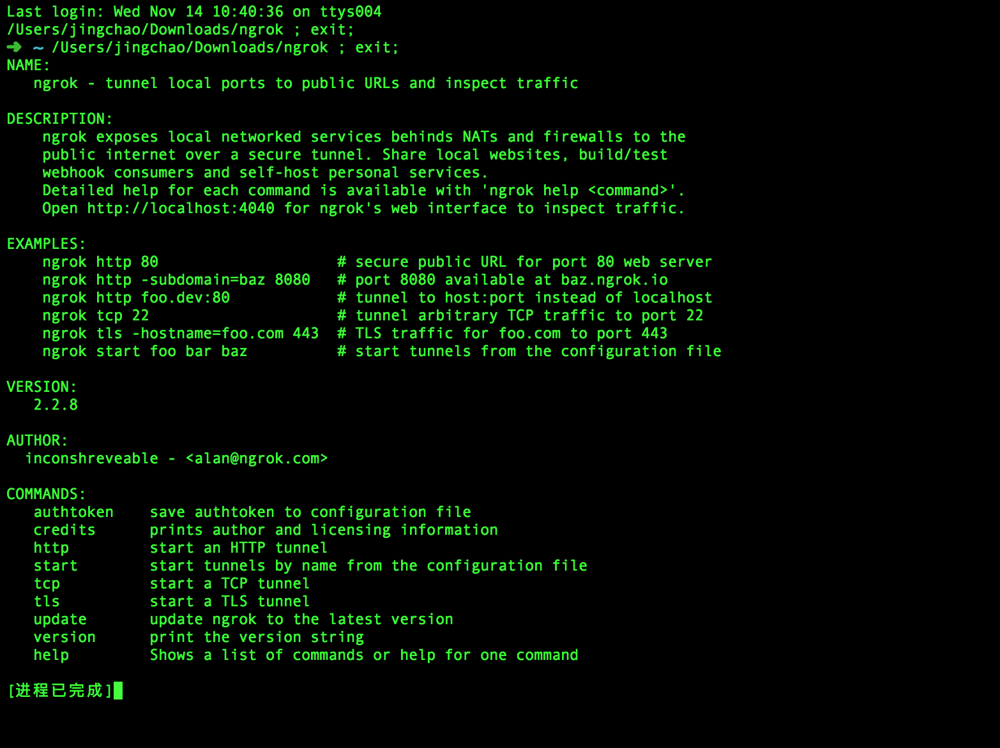
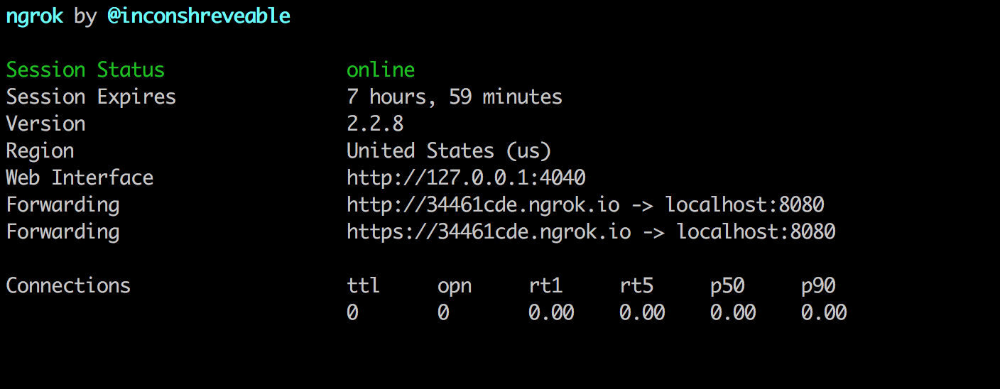
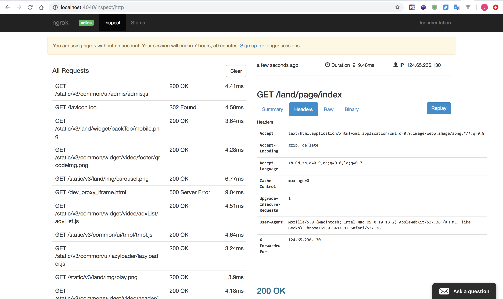
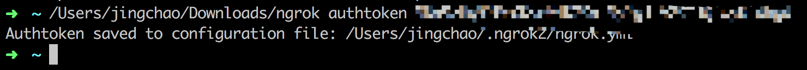

## ngrok官方服务

https://ngrok.com/ 

github登录

下载客户端

启动客户端



查看help
```
/Users/jingchao/Downloads/ngrok help
```

映射本地8080，启动后有一段时间的延迟才可访问
```
/Users/jingchao/Downloads/ngrok http 8080
```




访问localhost:4040查看请求


You are using ngrok without an account. Your session will end in 7 hours, 50 minutes. Sign up for longer sessions.
登录账号后会话不会过期

ctrl + C 停止进程

访问https://dashboard.ngrok.com/auth
添加自己的账号认证
```
/Users/jingchao/Downloads/ngrok authtoken 一段字符串
```



更多操作细则见文档https://ngrok.com/docs


## 服务器搭建ngrok

ngrok只开源了1版本，现在最新为2版本，可在自己服务器搭建1版本

https://github.com/inconshreveable/ngrok

https://www.aliyun.com/jiaocheng/1127349.html?spm=5176.100033.2.9.6de3220eAjxhCD

## 现状

ngrok国外服务器访问缓慢，代码仅开源了1版本，自己搭建服务器又不太现实

国内有人做了https://www.ngrok.cc/
访问还算可以，不像ngrok官方无法访问或访问太慢

注册登录后按照教程操作，下载对应的客户端执行，即可访问
```
/Users/jingchao/Downloads/darwin_amd64/sunny clientid 后台获取的clientid字符串
```
然后通过下面链接就可以访问到本地的localhost环境了
http://vland.free.idcfengye.com/land/page/index

## 了解更多

https://blog.csdn.net/zhangguo5/article/details/77848658
